# sonex — System Design & Architecture

How the system is put together: the runtime topology, the two hot paths (write and
read), the data model, and the rules that keep the pieces honest. Companion to
[`README.md`](./README.md) (what it is), [`CLAUDE.md`](./CLAUDE.md) (how we work),
[`PRODUCT.md`](./PRODUCT.md) / [`DESIGN.md`](./DESIGN.md) (why it looks like this),
[`DEV.md`](./DEV.md) (how to run it) and [`DEPLOY.md`](./DEPLOY.md) (how it ships).

Diagrams are Mermaid and render on GitHub. For relationship-level questions that these
diagrams don't answer, query the knowledge graph in `graphify-out/` — see
[§11](#11-keeping-this-document-true).

---

## 1. What the system is

sonex is a multi-tenant, cookie-free web-analytics SaaS. Three deployable frontends, one
stateful API, and the surfaces that API serves directly:

| Surface | Host | What it does |
| --- | --- | --- |
| Marketing | `trysonex.com` | Astro static site, docs, blog, free tools |
| Dashboard | `app.trysonex.com` | TanStack Start SPA — the product |
| API | `api.trysonex.com` | Hono — ingestion, analytics queries, auth, billing |
| Tracker | `api.trysonex.com/sonex.js` | 2.9 kB brotli IIFE served by the API, embedded on customer sites |
| Vitals | `api.trysonex.com/sonex-vitals.js` | Second bundle the tracker injects itself, only under `data-web-vitals` |
| Collect | `api.trysonex.com/p/:slug` · `/q/:slug` | Tracking pixel and short link — a public write surface with no JS |

The API brotli- and gzip-encodes both scripts once per process and content-negotiates on
`Accept-Encoding`, because Railway's edge gzips but answers a `br` request with identity.

Two workloads with opposite shapes share one Postgres: a **write path** that must be
cheap, bounded and never block the visitor's page, and a **read path** that runs wide
aggregate scans for one authenticated dashboard user at a time. Everything below follows
from that split.

### Design invariants

1. **No cookies, no personal identifiers.** A visitor's `session_id` is derived from a
   rotating salted fingerprint — nothing is stored on the visitor's device.
2. **The API is the only thing that touches Postgres.** Frontends are static bundles;
   all data flows through typed HTTP.
3. **`@sonex/db` owns all schema.** No table definitions live anywhere else.
4. **A `200` on ingest means the row is durable** (unless `INGEST_BUFFER` is opted into,
   which trades that guarantee for batching).
5. **A drop is always attributed.** Every rejected event names one of eleven reasons and
   increments a counter the site owner can read back.
6. **Permissions are one code path.** The public API key installs its owner as the
   request user, so a key can never reach a website its owner cannot.
7. **Config fails closed at boot.** t3-env validates on import, so a bad secret crashes
   the process instead of degrading a running one. Only `DATABASE_URL`, `APP_SECRET`,
   `BETTER_AUTH_SECRET` and `BETTER_AUTH_URL` are required; everything else has a default
   and degrades a feature rather than the server.

---

## 2. System context

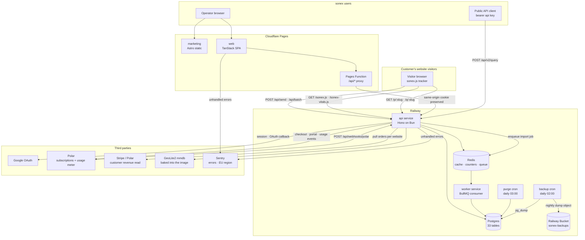

Two things worth calling out because they are non-obvious:

- **`app.trysonex.com/api/*` is proxied, not CORS'd.** The Pages Function at
  `packages/web/functions/api/[[path]].ts` forwards to the Railway origin so the
  better-auth session cookie stays first-party. In development the Vite dev server's
  `/api` proxy plays the same part, so the cookie behaves identically on `localhost`. The
  tracker, which is cross-origin by definition, talks to `api.trysonex.com` directly
  through a path-aware CORS middleware.
- **The tracker snippet must point at the API host.** Other hosts serve HTML, not JS.
- **Not everything lives under `/api/*`.** `/health`, `/config`, the two scripts and the
  two collect paths are top-level, which matters to anyone writing a proxy or cache rule
  against the `/api/*` bullet above.

---

## 3. Packages

A Bun + Turborepo workspace. Every package is `@sonex/*` at `version: "0.0.0"`.

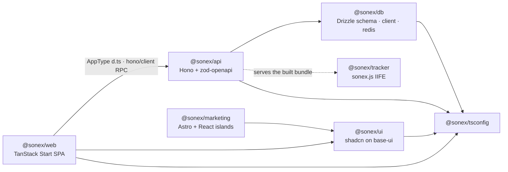

`packages/web` imports `AppType` from the **built** API declaration file — the RPC client
is fully typed end to end, and an API route change surfaces as a dashboard type error at
`bun turbo typecheck`. That is the merge gate doing the integration testing.

| Package | Boundary it owns |
| --- | --- |
| `api` | Every HTTP surface, every business rule, the only Postgres consumer |
| `db` | Schema, migrations, the postgres-js client, the Redis helpers |
| `web` | Dashboard rendering and client state; no business logic |
| `tracker` | Payload construction and delivery; pure logic split into `pure.ts` for tests |
| `ui` | Presentational primitives shared by `web` and `marketing` |
| `marketing` | Public content, SEO, glossary, free tools, generated agent files |

---

## 4. The write path — ingestion

The hot path. One visitor pageview is one `POST /api/send`; `/api/batch` carries several.
`processSend` in `packages/api/src/routes/send/send.service.ts` is the whole pipeline, and
it is the *only* way a row reaches `website_event` — the pixel and short-link endpoints
below funnel into the same function rather than writing their own rows.

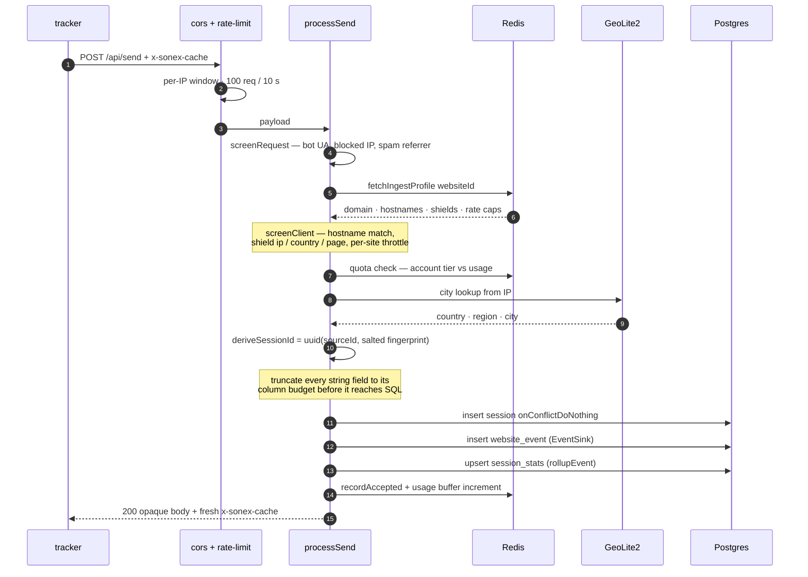

The `x-sonex-cache` header is a signed token the API mints on every accepted event and the
tracker echoes back on the next one, so repeat requests skip re-deriving session and geo
state. It carries the `websiteId` it was minted for and is rejected when that doesn't match
the payload's — otherwise a token from one site would be a write credential for another.

**Rejections answer `200` with the same opaque body a bot gets.** Naming the rule that
rejected an event would tell a spammer exactly what to change; the reason is recorded for
the site owner instead, as an hourly Redis hash read back by
`GET /api/websites/{id}/ingest-health`.

```
DROP_REASON = bot · blocked_ip · hostname_mismatch · quota · invalid · rate_limit
              spam_referrer · shield_ip · shield_country · shield_page
              no_session_for_engagement
```

### The second entrypoint — pixels and short links

`GET /p/:slug` answers a 1×1 GIF and `GET /q/:slug` answers a 302, both public, both behind
the same per-IP ingest limiter. Each synthesizes an event through `processSend` before
responding, attributed to the **`Referer`** — the page that embedded the pixel or held the
link — not to the collect URL itself. Ingestion errors are swallowed on this path: a
failing pipeline must never break someone's redirect or leave a broken image on their page.
This is why `link` and `pixel` are config entities in the data model but their clicks are
ordinary `website_event` rows.

### What the tracker does when the API says no

The client half of the "a `200` means durable" invariant. Every send aborts after 5 s. The
last send before a page or tab goes away uses `sendBeacon` rather than a `keepalive` fetch,
which browsers drop too readily at unload. And the tracker gives up for the rest of the
page session after three consecutive non-2xx answers, or immediately on a single `403` or
`429` — a blocked or over-quota site stops retrying instead of hammering the API.

### Cookie-free visitor identity

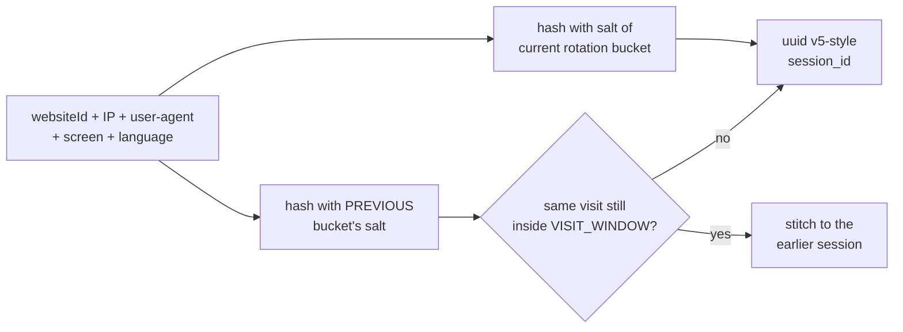

`SALT_ROTATION` is `day` in production. The two-salt stitch exists for exactly one case: a
visit in progress when the bucket rolls over at midnight UTC would otherwise split into
two visitors. Nothing about the visitor is stored — the identity is recomputed from the
request each time and simply stops being derivable once the salt rotates.

### Sinks and buffers

| Mechanism | Default | Trade |
| --- | --- | --- |
| `directSink` | on | One INSERT per event, committed before the ack. A `200` means durable. |
| `createBufferedSink` | `INGEST_BUFFER` | Multi-row INSERT every 1 s / 500 rows. **Any** drain failure — not just a hard crash — discards up to 500 rows, with no log line and no drop counter. Off in production. |
| `usage-buffer` | on | Billing counters coalesced in memory, flushed periodically. |

Both buffers are drained by the `SIGTERM` / `SIGINT` hook in `create-app.ts`. Without it,
every deploy would silently drop the last partial batch — and the usage counts that go
with it.

### Rollups

`rollupEvent` maintains `session_stats` on write so the dashboard's session and bounce
metrics are a lookup rather than a scan over `website_event`. Only real pageviews count as
pages of a visit — custom events, performance beacons and engagement heartbeats are
activity *within* one.

---

## 5. The read path — analytics queries

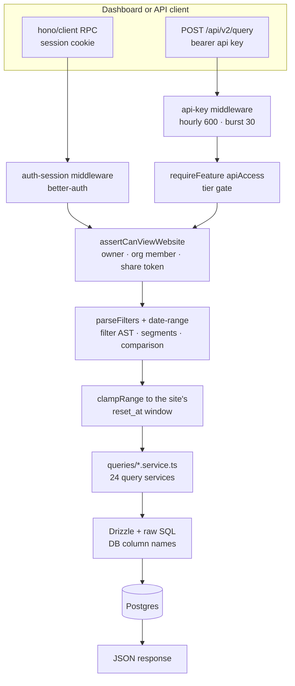

**Analytics reads are not cached.** Nothing under `queries/` touches Redis; every panel,
every report and every `/api/v2/query` call runs live SQL. The Redis entries in §7 cache
permission and config lookups on the *write* path, plus the external Stripe/Polar revenue
pull — that last one is the only 300 s TTL a user can actually observe, and the reason a
fresh sale can look stuck for a few minutes.

Three ways in, one permission check. `assertCanViewWebsite` is the single chokepoint —
cookie sessions, public API keys and unauthenticated share links all converge on it before
any query service runs.

The filter layer is an **AST**, not string concatenation: `lib/analytics/ast.ts` parses,
`filters.ts` compiles to SQL, and a saved **segment** is applied by rewriting that AST
rather than by wrapping the query. Comparisons re-run the same compiled query against a
shifted range.

Query services live one per metric in `packages/api/src/queries/` — active visitors,
attribution, funnel, journey, retention, revenue, performance, event/session/pageview
stats, and so on. Each is a pure `(db, filters) -> rows` function with a co-located
`*.service.test.ts` against a real Postgres.

### Guarding a user-authored query language

The filter AST is client-supplied, which makes the read path the one place a customer can
hand us something expensive. The guards are layered rather than clever:

| Guard | Where | Against |
| --- | --- | --- |
| depth 10 · 100 leaves · 200 clauses · 500 chars per clause | `ast.ts` | A filter tree that explodes into an unplannable query |
| 500-char cap on `~*` / `!~*` patterns | `filters.ts` | ReDoS — Postgres' regex engine backtracks |
| 3 dimensions · 10 000 rows | `query-v2.ts` | A public-API call asking for a cross-product |
| 10 funnel steps · 1 440-minute window | `reports` | Each step is another CTE arm with a nested `EXISTS` |
| 30 s `statement_timeout` | `db/client.ts` | Everything the four above missed |

Bind parameters carry the values; timezone and unit are whitelisted rather than
interpolated.

### Two settings that look like tuning and aren't

`prepare: false` on the postgres-js client is required, not preference: production reaches
Postgres through a transaction-pooling proxy, so a statement prepared on one backend
connection is simply missing on the next. It presented as intermittent 500s on time-series
endpoints that cleared on retry.

Named ranges (`day`, `7d`, `30d`, `all`) resolve on **UTC calendar days**; only the bucket
labels are re-expressed in the site's timezone, via `at time zone` at query time. Deriving
the boundaries in local time instead would make an `all` range shift depending on who was
looking at it. An unparseable timezone falls back to UTC rather than erroring.

### Saved reports

A `report` row stores a definition — type, name, parameters — and never a result; each
run re-executes live against whatever range the request carries, which is free to differ
from what was saved. Report runners also refuse a saved **segment** in their AST, unlike the
dashboard and `/api/v2/query` surfaces which expand them.

> **Gotcha carried forward:** raw SQL fragments use *database* column names
> (`event_id`, `website_id`), not the Drizzle camelCase field names.

---

## 6. Data model

33 tables, all defined in `packages/db/src/schema/`, migrated with drizzle-kit
(`0000` → `0018`) and applied on deploy.

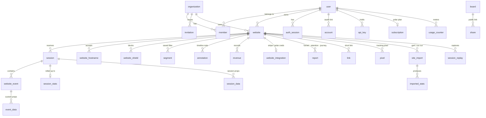

| Group | Tables | Notes |
| --- | --- | --- |
| Analytics (high write) | `session` `website_event` `session_stats` `event_data` `session_data` | The hot tables. No foreign keys — see below. `session` inserts use `onConflictDoNothing(session_id)`. |
| Websites & config | `website` `website_hostname` `website_shield` `segment` `annotation` `revenue` `website_integration` `report` | `website_integration` stores provider credentials AES-GCM encrypted. |
| Identity | `user` `auth_session` `account` `verification` `organization` `member` `invitation` | better-auth owns the shape; the org plugin is the canonical team model. |
| Billing | `subscription` `usage_counter` `subscription_event` | `usage_counter` is incremented atomically under an advisory lock. `subscription` is the current-state projection; `subscription_event` is the append-only history behind it. |
| Compliance | `audit_log` | Append-only record of who did what. Never updated except to pseudonymize an erased actor. |
| Entities | `board` `share` `link` `pixel` | |
| Imports | `site_import` `imported_stats` | Checkpointed by dataset so a run resumes. |
| Replay | `session_replay` `session_replay_saved` | Schema present; feature not shipped in the UI. |

**One organization is one team.** An entity's `teamId` holds the owning organization id and
membership/roles live in the plugin's `member` table — there is no separate teams model.

**The five hot tables declare no foreign keys.** Everywhere else — auth, organizations,
imports — uses real constraints with `ON DELETE CASCADE`. On the write path the reference
is a plain `uuid`, because every insert would otherwise pay for a constraint check, and the
tables already carry a heavy index load — 14 on `website_event`, 11 on `session`, 6 on
`session_data`, 5 on `event_data`: one `(website_id, created_at, X)` btree per filterable
dimension (browser, os, device, country, city, url path, referrer domain, event name…).
That count is the write-amplification budget, and so the number that decides when Postgres
stops being enough. The cost of dropping the FKs is that deletion is
**application-enforced** — a hand-rolled,
ordered sequence of `DELETE`s inside one transaction. A new hot table inherits that
obligation; a new config table should use a real FK.

**`website_event` is polymorphic.** One `event_type` discriminator covers six kinds of
row — pageview, custom event, link click, pixel fire, performance beacon, engagement
heartbeat — so every aggregate must filter for the kinds it means. A metric that forgets
silently counts pixel fires as pageviews and corrupts bounce and journey numbers.

**Imported history is kept apart from measured history.** A GA4 or CSV run writes
pre-aggregated daily rows to `imported_stats` rather than synthesizing `website_event`
rows: fake events would invent visitor identities that never existed, and every
session-derived metric downstream would inherit the fiction. Imported totals are therefore
a parallel series, read on their own terms rather than mixed into the session tables.

> `packages/db/tests/schema.test.ts` asserts the table count. Adding a table without bumping
> it fails only under `turbo test` / CI, not a single-package vitest run.

---

## 7. Cross-cutting concerns

### Auth and tenancy

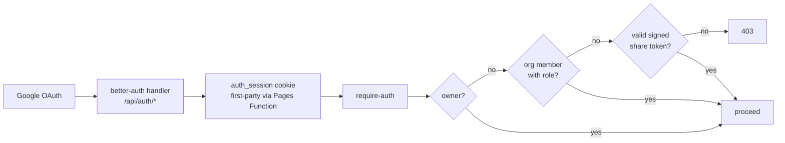

Google OAuth only. The better-auth **admin** and **organization** plugins are enabled for
their schema and session enforcement, but their native HTTP endpoints are blocked at the
mount in `src/index.ts` — they gate on role alone and would bypass the app's own guards
(self-lockout, no admin-on-admin ban, tier and seat limits). Admin and team actions flow
only through the guarded `/api/users/*` and `/api/teams/*` routes.

Session parsing is global, not per-route: one middleware runs ahead of the whole route
chain and populates both the better-auth user and, from the `x-sonex-share-token` header,
the share token — failing closed on any parse error. `requireAuth` and `requireAdmin` are
then only null-checks against what it already resolved.

That split explains a second pattern. Realtime, ingest-config and the website analytics
routes declare **no** route-level auth middleware and instead call `assertCanViewWebsite`
inside the handler, which is precisely what lets a share-link holder reach them with no
session at all. Ingest config splits further: a share viewer may read `ingest-health`, but
only an owner or an org role with edit rights may change hostnames, shields or rate caps —
a viewer must not be able to silence a domain.

The bearer-key API is narrower than the system-context diagram suggests: a single route,
`POST /api/v2/query`, and a single scope, `stats:read`. Keys are stored as a SHA-256 hash
and carry a `sonex_live_` prefix so secret scanners recognize a leak.

### Secrets and key derivation

One root `APP_SECRET` backs three independent HKDF-SHA256 subkeys, domain-separated by
purpose: JWT signing (share and cache tokens), credential encryption (the AES-GCM key for
`website_integration`), and the deterministic salt behind `session_id`. Nothing uses the
root secret directly, so a weakness or leak confined to one context cannot compromise the
others.

Share tokens are stateless JWTs with a one-hour TTL, re-minted on each resolve. Revocation
does not wait for expiry — every use re-checks that the backing share row still exists, so
deleting a share link kills outstanding tokens immediately.

### Billing and metering

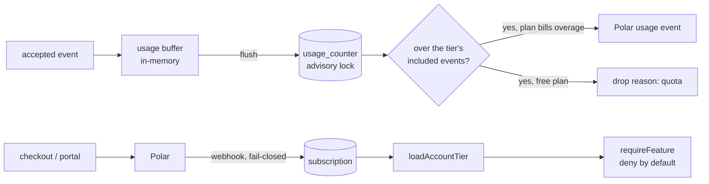

| Tier | Events / month | Websites | Seats | Retention | Overage |
| --- | --- | --- | --- | --- | --- |
| free | 2 000 | 1 | 1 | 180 d | hard cap |
| pro | 200 000 | 20 | 10 | 365 d | $0.00003 / event |
| business | 2 000 000 | 100 | unlimited | 5 y | $0.00002 / event |
| enterprise | unlimited | unlimited | unlimited | unlimited | none — assigned manually |

`UNLIMITED_USERS` is a comma-separated allowlist that resolves to the enterprise tier
inside `loadAccountTier`. One chokepoint unlocks the whole API and the dashboard — the
frontend needed no changes for it.

Retention is enforced by the `purge` cron, not by a query filter: rows past the account's
plan window are deleted for real. That job connects first and waits for the database,
because a sleeping Postgres answers the first query with `57P03` and used to crash the run.

### Customer revenue

Separate from *our* billing: a website can connect its own Stripe or Polar account
(`website_integration`, credentials AES-GCM encrypted at rest). `provider-revenue.service`
pulls orders and writes the `revenue` table, so money sits next to traffic on the overview.
Revenue reads are cached in Redis on hour-rounded keys for 300 s — the reason a fresh sale
can appear "stuck" for a few minutes.

### Caching and Redis

| Key prefix | TTL | Purpose |
| --- | --- | --- |
| `ingest-profile:` | 24 h | Per-site hostnames, shields and rate caps as one GET instead of three queries |
| `website:` / `account-tier:` / `account-of:` | 24 h | Permission and tier lookups on the hot path |
| `link-slug:` / `pixel-slug:` | 24 h | Public redirect resolution |
| `drops:{siteId}:{YYYYMMDDHH}` | 8 d | Accept/drop counters per reason |
| `apikey:` | — | Key resolution + two rate-limit windows |
| `revenue-provider:v2:` | 300 s | The Stripe/Polar order pull — the only cached *read* |
| `imports` | — | BullMQ queue, drained by the `worker` service |

**Rate limiting fails open in both directions:** an unconfigured Redis and a live Redis
that throws both answer "allow". Limits and IP shields are therefore an availability-first
layer — ingestion keeps accepting when Redis is unreachable, and nothing on the durable
write path depends on it.

Imports are the exception to "optional". With `REDIS_URL` set the API enqueues import runs
instead of doing them inline, so a missing `worker` consumer leaves every import `pending`
forever. With no Redis at all the API imports inline, which a large GA4 run outlives.

### Geo lookup

`APIS --> GEO` in the context diagram is two steps. CDN-provided country headers
(Cloudflare, Vercel, CloudFront, Edgio) are trusted first and short-circuit the lookup;
only then is the baked-in GeoLite2 database opened. A missing or unreadable `.mmdb` sets
the reader to null instead of throwing — ingestion keeps working, geo just goes empty, and
behind a CDN it may not even degrade.

### Retention has two clocks

The purge cron is only half of it. Each website carries a `reset_at` pointer, and **every**
read clamps its date range to that pointer. Moving it — a GDPR erasure, a manual reset —
makes data unreadable instantly, while the physical `DELETE` waits for the next nightly
run. "Unreadable" and "deleted" are allowed to disagree in between, on purpose.

That second clock is the *manual* one only. `reset_at` is written in exactly one place,
`resetWebsite`; `runPurge` never advances it. Tier retention therefore has no read-side
clock — data past a plan's window stays readable until the physical delete removes it.

The purge works on the raw tables: `event_data`, `session_data`, `website_event`,
`session_replay` and `session` (`lib/billing/retention.ts` · `PURGE_TABLES`).
`session_stats` is not one of them, and no other path deletes it either — it is currently
written by every visit and removed by nothing.

### Ingest trust boundary

Rate limiting and IP-based shields resolve the client IP through `TRUSTED_IP_HEADER` when
configured, so the key can't be forged by sending spoofed headers to the origin. Share
slugs are rate-limited to blunt enumeration. `verify-install` re-checks every redirect hop
against private address ranges rather than only the first — a public host is free to
redirect to `127.0.0.1` or a cloud metadata endpoint — and caps hops, bytes read and total
time.

The permissive `origin: "*"` CORS policy is an exact two-path allowlist, `/api/send` and
`/api/batch`, and is safe only because the tracker never sends credentials. The dashboard's
own origins come from `WEB_ORIGINS` with `credentials: true`. The scripts, pixel and link
routes need no CORS at all — browsers load them via `<script src>`, `` and
navigation, not `fetch`.

### Request conventions

Every request gets a `randomUUID()` request id, echoed back as `x-request-id` and written
as one structured JSON line to stdout with method, path, status and duration. Errors come
in two shapes: schema validation fails as `422` with the Zod issues, everything else as
`{ success: false, error, requestId }`. An unexpected error never puts its message in the
response — the stack goes to stderr under the same request id, and the caller gets the id
to quote.

Every log line carries `message` and `level`, because that pair is what a log platform
renders and colours a JSON line by. Without them the object is captured but shows up blank,
and every other field on it is invisible — which is how a production `xffHops` measurement
was once lost. Railway retains those lines for its plan's window (7 d Hobby, 30 d Pro,
90 d Enterprise); anything longer needs a drain to a third-party sink.

### Error tracking

Errors are reported to **Sentry**, at four severities that exist so the signal stays
readable:

| Kind | What it is | Where |
| --- | --- | --- |
| **Error** | A defect: an unhandled request failure, a silent swallow that loses data or money, a job that could not finish | `onError`, the import worker's `failed` and `error` handlers, both crons' top-level catches, ~19 previously-silent `catch` blocks in the API, and on the client every failed mutation plus any read that is not a deliberate 4xx |
| **Warning** | A degraded path that recovered: an unparseable address, an expired share token, a mangled URL component, a mis-configured ignore range | The input-parsing helpers on the ingest path |
| **Log** | One structured line per failure — a 5xx request, a cron waiting on a sleeping database | `middlewares/logger.ts` and the crons. Only `warn`/`error`/`fatal` are forwarded; an info line per request would be quota with no diagnostic value |
| **Check-in** | A cron that fired, finished, and how long it took | The nightly backup (`0 2 * * *`) and the retention purge (`0 3 * * *`) |

Handled `HTTPException`s are deliberately **not** reported: a 4xx is an answer, not a
defect, and would bury the real ones. The same rule shapes the client — a 401 (expired
session) or 403 (a panel behind a higher tier) on a read is the product working.

Check-ins are the one report that fires when *nothing* happens. A cron that stops running
throws no error at all, so without them a backup that quietly died is discovered at the
moment it is needed.

Repeats are rate-limited per call site, not per severity: a Redis outage on the per-event
metering path would otherwise file one event per request for the length of the outage. Each
distinct call site reports at most once a minute.

It is opt-in on a DSN (`SENTRY_DSN` server-side, `VITE_SENTRY_DSN` in the browser bundle).
With none set the SDK is never initialised, so dev, CI and the test suite send nothing.

The privacy posture is explicit rather than inherited. The SDK's defaults collect cookies,
request and response headers, bodies, URL query strings, database query data and local
stack variables; **every one of those categories is denied** in `lib/sentry.ts` on both
sides, and tracing is off. No client IP is ever sent — the address that failed to parse is
precisely the value these reports refuse to carry, so the failure mode travels and the
address does not. A signed-in account is identified by its **opaque user id only**, never
its email.

The browser SDK keeps Sentry's *default* integrations, which is what reports an uncaught
error or an unhandled rejection at all. **Session replay is not among them** and must never
be added: it would record a customer's dashboard, and with it their visitors' data, inside
a product sold on not collecting it. What leaves the process is the exception type, the
message, the stack, and identifier-only tags (request id, method, path, route, scope,
status, user id).

Browser stack traces resolve through source maps uploaded at build time when CI supplies
`SENTRY_AUTH_TOKEN`. The maps are emitted `hidden` and deleted once uploaded, so none of
them ever reaches Cloudflare Pages.

The OpenAPI document at `/doc` and the Scalar UI at `/reference` are gated behind
`DOCS_ENABLED`, off by default, because `/doc` enumerates every route and schema in the
system. The one schema published unconditionally is `/api/docs/query/schema.json` — the
same Zod schema `/api/v2/query` validates against, served so clients can't drift from it.

---

## 8. Background work and the data lifecycle

Four things happen outside a request: imports, the retention purge, the nightly database
backup, and deletion. Each runs in its own Railway service, and their restart policies are
the contract.

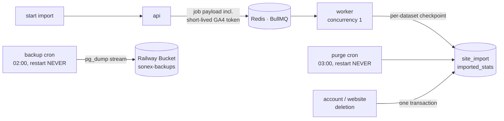

**Imports resume, they don't restart.** The worker runs one job at a time — overlapping
runs of the same import would fight over one checkpoint — and records `{offsets: {dataset:
rowsCommitted}}` after each dataset. Row writes upsert on
`(importId, dataset, date, dimensionValue)`, so a chunk re-processed at a resumed boundary
overwrites instead of doubling. `SIGTERM` lets the in-flight dataset finish rather than
killing it, so a clean shutdown always leaves a checkpoint to resume from.

The GA4 access token rides on the Redis job and is never written to Postgres. It expires
with the job instead of outliving it in a table.

**Export is the same engine as the dashboard.** CSV export calls `runQueryV2` — the exact
function behind `/api/v2/query` — so an export and the panel it was taken from cannot
disagree about the same range.

**The purge must not restart.** Its Railway policy is `NEVER`, because a cron job that
exits `0` is finished, not crashed; restarting it would re-purge on every container stop.
The self-hosted stack has no scheduler, so there the same script runs as a `sleep 86400`
loop — it fires on container start rather than at 03:00, which is a genuinely different
retention timing between the two deploy targets.

**The backup cron writes outward, not inward.** At 02:00 UTC it streams `pg_dump --format=custom`
straight into a Railway Bucket rather than staging a file on disk, so the container needs no
volume and the dump size is bounded by the database, not by the service. It prunes objects
past the retention window in the same run, and it is the only background job whose failure is
worth waking up for — see [`BACKUP.md`](./BACKUP.md) for the schedule, the restore procedure
and the measured RPO/RTO. Its restart policy is `NEVER`, for the same reason the purge's is.

**Deletion is hard, with two deliberate exceptions.** GDPR account deletion walks the
user-keyed tables explicitly inside one transaction — the hot tables have no cascade to
lean on — and takes the encrypted `website_integration` credentials with it, since payment
credentials must not survive an erasure. Because the coverage is written by hand rather
than declared by the schema, `deletion-coverage.test.ts` reflects over every table carrying
a `website_id` and fails the build if any of them is absent from a deletion path — it is
what stops a new table from being quietly forgotten here.

Two rows are deliberately kept, and both are compliance decisions rather than oversights.
`subscription_event` survives: it is the append-only billing history an auditor reads, it
holds no personal data, and once the transaction commits its `account_id` resolves to
nobody. `audit_log` survives **pseudonymized** — the actor link is cut and the email
snapshot is replaced by an irreversible keyed digest, so entries stay correlatable to one
another while identifying no one. That is how an append-only trail and a right to erasure
coexist; deleting the trail instead would satisfy neither.

Deleting a *website* hard-deletes all its
analytics rows but soft-deletes the `website`, `link` and `pixel` rows themselves, so
slugs stay claimed and cannot be silently re-pointed at another site.

---

## 9. The dashboard

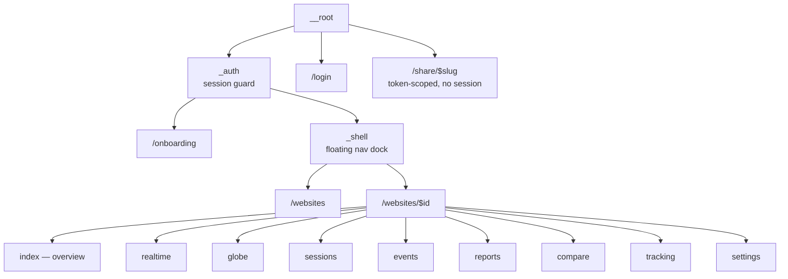

SPA-only (`tanstackStart({ spa: { enabled: true } })`), served as static files from
Cloudflare Pages. TanStack Query owns all server state and the URL owns all view state —
date range, granularity, filters, selected report and the bounce toggle live in route
search params, never in a store, so any dashboard view is a link. There is no client-side
business logic. Demo mode swaps the `fetch` passed to `hc()` for a fixture-backed one, so
the whole dashboard runs with no backend at all.

Two guards sit either side of the session. The `_auth` route checks it on entry; a global
`onError` on the QueryClient catches a `401` from *any* query or mutation and redirects,
which is what covers a session expiring mid-use or being revoked in another tab. Without
the second, a live session loss would strand the user on a panel that just errors forever.

**Client-side gating is advisory.** `useEntitlements` decides which affordances to lock,
but the server answers `403`/`429` on its own — the UI gate is a courtesy, never the
enforcement. This is design invariant #6 seen from the one place it could quietly be
violated by trusting client state.

The SPA also heals two deploy-shaped failures itself. A `vite:preloadError` — a lazy chunk
404ing to the shell after a deploy replaced hashed names — triggers exactly one reload,
guarded by a cooldown flag so a genuinely broken build surfaces its error instead of
reload-looping. And a cold landing on the prerendered `/_shell` artifact, typically a stale
post-OAuth redirect, is treated as "go home" rather than a real 404.

> Because it is SPA-only, module-level state such as the active share token is safe. If SSR
> is ever re-enabled that becomes a cross-request leak and must be made request-scoped.

> **Gotcha carried forward:** the globe imports MapLibre's worker as `?worker&url`. A plain
> `?url` leaves its sibling chunk unbundled, that request 404s into the SPA fallback and
> comes back as HTML, and the map renders as a bare sphere with nothing logged.

---

## 10. Build, test and deploy

The whole product runs locally on `docker compose up` — Postgres, Redis, Adminer, the API,
the dashboard and the marketing site, all bind-mounted against the working tree with hot
reload. Each `node_modules` is masked by a named volume (the host's are macOS binaries and
Linux cannot load them), a one-shot `deps` service populates them, and a one-shot `migrate`
service applies the same forward-only migrator Railway runs on deploy. Inside that network
the dashboard needs `VITE_API_PROXY_TARGET=http://api:8787`, because `localhost` there is
the web container itself. [`DEV.md`](./DEV.md) covers this and the native path.

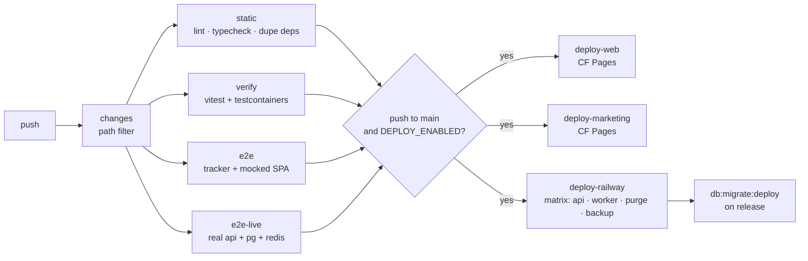

`/health` is the deploy gate on Railway, and it is a pure liveness probe: it answers
`{status, uptime}` from the process itself and checks no dependency. What a green deploy
attests to is that the process is up — correctness is established beforehand, by the gate
below.

| Layer | Tool | Where |
| --- | --- | --- |
| Unit | Vitest, `*.service.test.ts` | co-located |
| Integration | Vitest against real Postgres + Redis | co-located `*.test.ts` |
| E2E mocked | Playwright, network-layer API mock | `packages/web`, `packages/tracker` |
| E2E live | Playwright against a real stack, seeds its own account | `packages/web` — `bun run e2e:live` |

Deploy specifics — Railway services, Cloudflare projects, DNS, required env — live in
[`DEPLOY.md`](./DEPLOY.md); the job graph, the path filter and what gates each deploy are
in [`.github/README.md`](./.github/README.md). Four standing rules from painful experience:

- **No build caching in CI.** A partial turbo cache once shipped an empty `dist` to
  production.
- **Deploy web from `packages/web`,** so wrangler compiles the `functions/` proxy. The step
  retries: Cloudflare answers the deployment-creating POST with a 524 often enough that a
  green upload can still leave production on the previous build.
- **HTML and unhashed assets must revalidate.** Both Cloudflare projects ship a `_headers`
  file. A chunk from a superseded build falls through the SPA catch-all as `200 text/html`;
  under a long asset cache the browser stores that HTML at a `.js` URL and the app blanks
  until the entry expires.
- **Pin singleton dependencies in the root `overrides`.** `Dockerfile.api`'s runtime stage
  installs with no lockfile, so a caret range there resolves to whatever npm calls
  latest — which is how better-auth floated to 1.7.0 and broke production login.
- **The API's runtime image is Debian, not Alpine.** It builds on Alpine and ships on
  `slim` on purpose: under musl, Bun's DNS resolver cannot resolve Railway's private
  `*.railway.internal` domains, so the API never reaches Postgres or Redis at all.
- **Migrations run inside the API's start command,** not a pre-deploy hook. Railway's
  pre-deploy container has no private-network access, so a migrator there cannot see the
  database it is supposed to migrate.

---

## 11. Keeping this document true

This file describes structure, not line numbers, so ordinary changes don't invalidate it.
Update it when a **boundary** moves: a new package, a new deployed service, a new external
dependency, a change to the ingest pipeline's stages, or a new table group.

For anything finer-grained, use the knowledge graph instead of grepping:

```bash
/graphify query "how does an event become a session row"
/graphify path "processSend" "session_stats"
/graphify explain "assertCanViewWebsite"
/graphify packages --update      # rebuild after non-trivial changes
```

